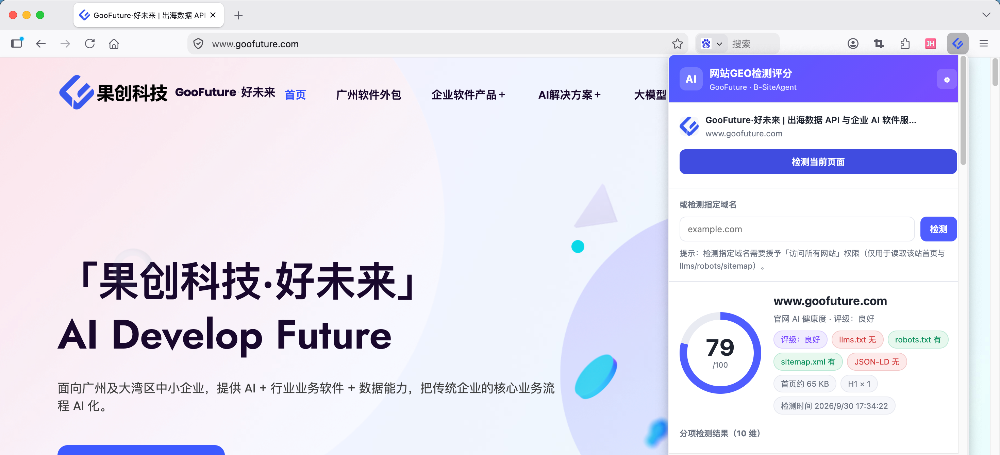

# 网站GEO检测评分 · 浏览器插件（Chrome / Edge 通用，GooFuture · B-SiteAgent AI）

一键检测**任意企业官网**的「AI 可读性」——也就是这家网站被 **AI 搜索 / AI 问答 / AI 智能体**
读懂、引用、调用的能力。插件在你本地完成 10 维评分、薄弱项优化建议、报告与 SKILL 生成，
并可选择调用 DeepSeek 做 AI 深度诊断、或把结果提交到 [GooFuture 官网](https://goofuture.com/company-website-ai-agent/ai-check/) 公开收录。

> 本插件的评分逻辑是 GooFuture 线上 PHP 检测（`detect.php`）与开源 Python 版（`ai-website-check-skill`）
> 的**权威移植**，本地分数与官网收录分数口径一致。

> **Microsoft Edge 用户**：本扩展基于 Chromium 内核的 Manifest V3 开发，与 Chrome 共用同一套 API（`chrome.*`），
> **同一份代码无需任何修改即可在 Edge 上运行**（详见下方「Microsoft Edge 适配说明」）。

## 插件效果

> 加载扩展后打开任意企业官网，点击工具栏图标即可检测。  
  
  

## 它能做什么

1. **检测当前页面**：打开任意网站，点一下插件图标 → 「检测当前页面」，瞬间拿到 10 维评分。
2. **检测指定域名**：在输入框填入 `example.com` 即可（首次会请求「访问所有网站」权限，仅用于读取该站首页与 llms/robots/sitemap）。
3. **10 维评分**：企业信息 / 产品信息 / AI 可理解性 / 内容结构化 / FAQ / 联系方式 / 图片信息 / 文档利用 / AI 引用友好度 / Agent 友好度，综合 0–100 分与评级（优秀 / 良好 / 中等 / 偏弱 / 较弱）。
4. **优先优化建议**：自动挑出最弱的 3 项，给出可操作的改站方案。
5. **AI 深度诊断**（可选）：填入你自己的 DeepSeek API Key，本地调用 DeepSeek 生成一份「老板能看懂」的诊断报告。Key 仅保存在本地，不上传。
6. **下载报告 / SKILL**：一键导出自包含 HTML 报告与 `SKILL.md`（可直接导入 WorkBuddy 等 AI 工具执行改站）。
7. **提交收录**（可选）：把检测结果回传到 GooFuture 官网 `detect.php?action=save`，由官网生成公开报告并纳入检测列表。

## 10 个评分维度

| # | 维度 | # | 维度 |
|---|---|---|---|
| 1 | 企业信息完整度 | 6 | 联系方式 |
| 2 | 产品信息完整度 | 7 | 图片信息识别 |
| 3 | AI 可理解性 | 8 | PDF / 文档利用 |
| 4 | 内容结构化 | 9 | AI 引用友好度 |
| 5 | FAQ 完整度 | 10 | Agent 友好度 |

## 安装（开发者模式加载）

1. 打开 Chrome → `chrome://extensions` → 右上角开启「开发者模式」。
2. 点击「加载已解压的扩展程序」，选择本仓库目录（含 `manifest.json` 的目录）。
3. 固定插件到工具栏，打开任意企业官网，点击图标即可检测。

> 发布到应用商店（Chrome Web Store / Microsoft Edge Add-ons）前，请替换 `icons/` 下的图标（当前为程序生成的占位图标）。

## Microsoft Edge 适配说明

本扩展基于 Chromium 内核的 **Manifest V3** 开发，与 Chrome 共用同一套扩展 API（`chrome.*`）。
**代码无需任何修改即可在 Microsoft Edge 上运行**——本分支（`edge`）仅补充 Edge 专属的
安装与上架说明，源码与 `main` 分支（Chrome 版）保持一致，可同时提交两个商店。

### 本地加载（开发者模式）
1. 打开 Edge → 地址栏输入 `edge://extensions` → 左下角开启「开发人员模式」。
2. 点击「加载解压缩的扩展」，选择本仓库目录（含 `manifest.json` 的目录）。
3. 点击工具栏的扩展图标（拼图按钮）将其固定，打开任意企业官网即可检测。

### 发布到 Microsoft Edge Add-ons（微软应用商店）
1. 注册 [Microsoft Partner Center](https://partner.microsoft.com/) 开发者账号（一次性注册费，约 19 美元 / 99 元）。
2. 进入 **Edge Add-ons 开发人员仪表板** → 新建扩展 → 上传本仓库打包后的 **.zip**（不要包含 `.git`）。
3. 填写商店信息：名称、简介、分类（建议选「生产力 / 开发者工具」）、语言、128px 图标。
4. **隐私政策（必填）**：Edge 强制要求提供隐私政策链接。可复用 GooFuture 官网隐私政策页，
   内容需明确：「评分 / 报告 / SKILL 均在浏览器本地完成，仅在用户主动点击『提交收录』或『AI 深度诊断』时才对外请求」。
5. **权限用途说明（重点）**：`optional_host_permissions: <all_urls>` 需在审核问卷中说明用途——
   「用于读取用户指定的域名首页及其 `llms.txt` / `robots.txt` / `sitemap.xml`，以完成本地评分」。
   Edge 对宽泛主机权限审核比 Chrome 更严，**保留为 `optional`（按需申请）可显著降低被拒风险**；切勿改成强制 `host_permissions`。
   > 逐项权限用途说明的**可直接粘贴文案**见 [`STORE-PERMISSIONS.md`](./STORE-PERMISSIONS.md)（Chrome Web Store 同样适用）。
6. 上传 1–2 张功能截图与宣传图，提交审核（通常 1–3 个工作日）。

> 打包命令（仓库根目录执行，排除 `.git`）：
> ```bash
> zip -r ai-website-check-extension.zip . -x '*.git*'
> ```

### 与 Chrome 版的差异
- 代码完全一致，同一个 `manifest.json` 可同时提交 Chrome Web Store 与 Microsoft Edge Add-ons。
- 仅**商店上架流程与审核要求**不同（见上），无需维护两套源码。
- Edge 不建议在本清单里写 `update_url`（那是 Chrome Web Store 专用），当前清单未包含，符合规范。

## 权限说明

| 权限 | 用途 |
|---|---|
| `activeTab` / `scripting` | 检测「当前打开的页面」（注入提取脚本） |
| `storage` | 本地保存你的 DeepSeek Key |
| `host_permissions: goofuture.com` | 提交收录（扩展对 Host 权限豁免 CORS，无需改服务端） |
| `host_permissions: api.deepseek.com` | 调用 DeepSeek 做 AI 诊断 |
| `optional_host_permissions: <all_urls>` | 仅当你使用「检测指定域名」时按需申请，用于 fetch 该站首页与基建文件 |

> 评分、报告、SKILL **全部在浏览器本地完成**，不上传任何数据；只有你主动点击「提交收录」或「AI 深度诊断」时才会对外请求。

## 目录结构

```
ai-website-check-extension/
├── manifest.json      # MV3 清单
├── popup.html         # 弹窗界面
├── popup.css          # 样式
├── popup.js           # 交互逻辑（检测 / 诊断 / 提交 / 下载）
├── engine.js          # 评分引擎（10 维）+ 报告 / SKILL / Prompt 生成（纯 JS，可单测）
├── extract.js         # 注入到当前页面的提取函数（DOM + 同源探测 llms/robots/sitemap）
├── icons/             # 16 / 48 / 128 PNG
└── README.md
```

## 与官网 / 开源 Python 版的关系

- 三者评分逻辑完全一致，任一处升级都需要同步另外两处（这是已知约束）。
- 线上：`goofuture.com/company-website-ai-agent/ai-check/`
- 开源 Python 版（命令行 / WorkBuddy 技能）：`github.com/goofuture/ai-website-check-skill`
- 本插件：浏览器内一键检测，离线优先。

## 许可证

[MIT](./LICENSE) © 2026 广州果创网站科技有限公司（GooFuture）
